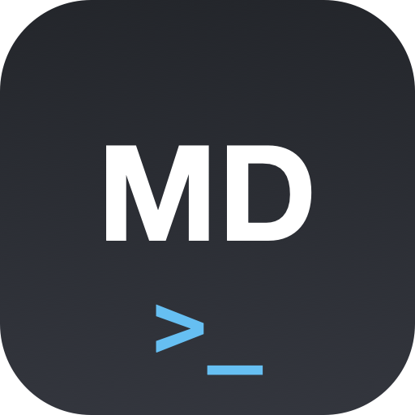

<p align="center">
  
</p>

# md-preview-cli

A CLI tool that renders markdown files in a native frameless macOS window. Designed for terminal-only agents like Claude Code.

## Features

- Native frameless window with rounded corners and shadow
- CommonMark + GFM rendering with syntax highlighting (Chroma)
- KaTeX math and Mermaid diagram support (lazy-loaded)
- Live reload on file changes (fsnotify + polling fallback)
- Multi-window support — each file opens in its own window
- Table of contents sidebar
- Dark/light/system theme with CSS custom properties
- Vim-inspired keyboard shortcuts
- Pipe from stdin for fire-and-forget previews

## Install

Requires Go 1.24+ and macOS (CGO + Cocoa).

```bash
git clone https://github.com/mxcoppell/md-preview-cli.git
cd md-preview-cli
make deps    # download vendored JS dependencies (first time only)
make build   # debug build → ./bin/md-preview-cli
```

## Usage

```bash
# Preview a file with live reload
md-preview-cli README.md

# Preview multiple files (each in its own window)
md-preview-cli doc1.md doc2.md

# Pipe from stdin
echo "# Hello World" | md-preview-cli
cat README.md | md-preview-cli

# Options
md-preview-cli --theme dark README.md
md-preview-cli --toc README.md
md-preview-cli --browser README.md    # open in system browser instead
```

## Keyboard Shortcuts

| Key | Action |
|-----|--------|
| `j` / `k` | Scroll down / up |
| `n` / `p` | Next / previous heading |
| `]` | Toggle table of contents |
| `Cmd+F` | Search |
| `T` | Toggle theme |
| `+` / `-` | Zoom in / out |
| `0` | Reset zoom |
| `h` | Show shortcuts |
| `Esc` | Close window |

## Build

```bash
make build     # debug build with symbols (~21 MB)
make release   # stripped release build (~16 MB)
make test      # run all tests
make clean     # remove build artifacts
```

## License

MIT
