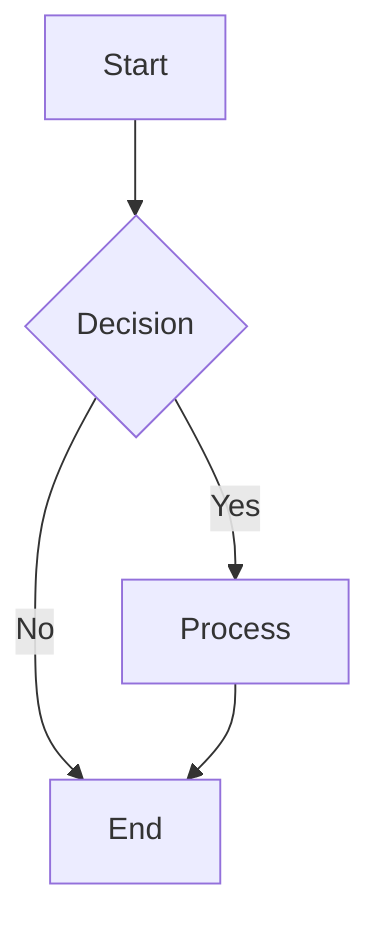
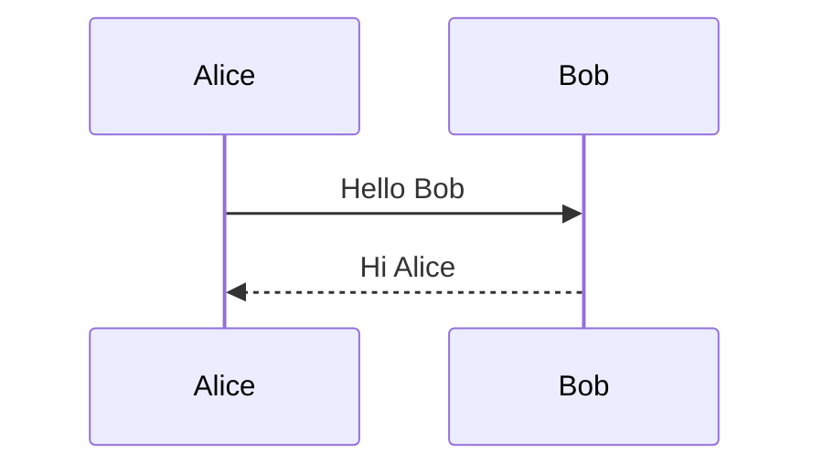

# Full Specification Test

This document tests **all** supported markdown features.

## GFM Features

### Tables

| Feature | Status | Notes |
|---------|--------|-------|
| Tables | Done | GFM extension |
| Strikethrough | Done | ~~like this~~ |
| Task Lists | Done | See below |
| Autolinks | Done | https://example.com |

### Task Lists

- [x] Completed task
- [ ] Incomplete task
- [x] Another done

### Strikethrough

This is ~~deleted text~~ with strikethrough.

### Autolinks

Visit https://github.com for more info.

## Typography

"Smart quotes" and 'single quotes' are handled.

Dashes: em---dash and en--dash.

Ellipsis: ...

## Code Blocks

Inline code: `const x = 42`

```go
package main

import "fmt"

func main() {
    fmt.Println("Hello, World!")
}
```

```python
def fibonacci(n):
    if n <= 1:
        return n
    return fibonacci(n - 1) + fibonacci(n - 2)
```

```javascript
const sum = (a, b) => a + b;
console.log(sum(1, 2));
```

## Math

Inline math: $E = mc^2$

Block math:

$$
\sum_{i=1}^{n} i = \frac{n(n+1)}{2}
$$

$$
\int_{-\infty}^{\infty} e^{-x^2} dx = \sqrt{\pi}
$$

## Mermaid Diagrams





## Blockquotes

> This is a blockquote.
> It can span multiple lines.

> Nested blockquote:
>> This is nested.

## Admonitions

> [!NOTE]
> This is a note admonition. It provides additional context.

> [!TIP]
> This is a tip. Use it for helpful suggestions.

> [!WARNING]
> Be careful with this operation.

> [!CAUTION]
> This action is irreversible.

> [!IMPORTANT]
> Do not skip this step.

## Lists

### Unordered

- Item one
  - Sub-item A
  - Sub-item B
- Item two
- Item three

### Ordered

1. First
2. Second
3. Third

### Definition Lists

Term 1
: Definition for term 1

Term 2
: Definition A for term 2
: Definition B for term 2

## Footnotes

Here is a sentence with a footnote[^1].

And another[^2].

[^1]: This is the first footnote.
[^2]: This is the second footnote with more detail.

## Emoji

:wave: :rocket: :star: :heart:

## Links and Images

[Link to GitHub](https://github.com)


## Horizontal Rules

---

***

## Heading Levels

# H1 Heading
## H2 Heading
### H3 Heading
#### H4 Heading
##### H5 Heading
###### H6 Heading

## HTML (Unsafe)

<details>
<summary>Click to expand</summary>

This is hidden content inside a details/summary block.

</details>

---

*End of full specification test.*
